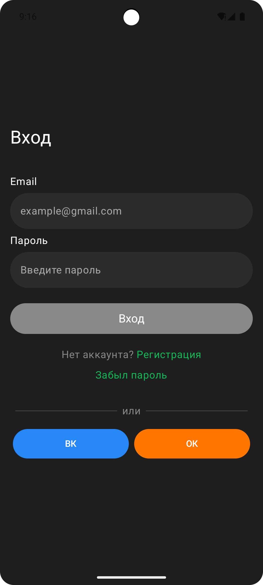
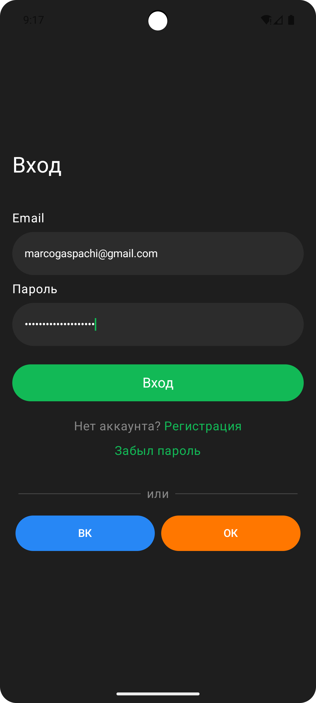
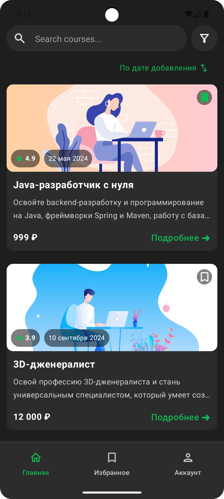
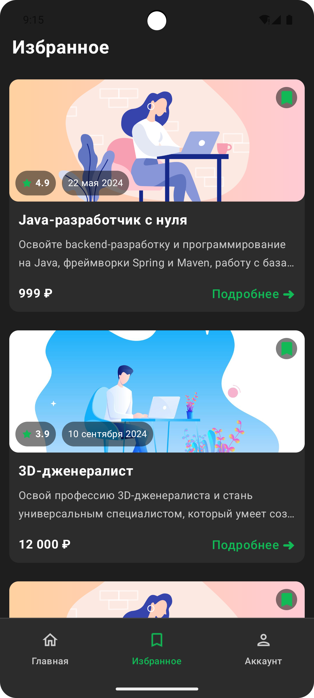

# CoursesApp

## Описание 📝

CoursesApp - это Android приложение для просмотра списка курсов, добавления их в избранное и отображения информации о них. Приложение разработано с использованием современных технологий и принципов Clean Architecture.

---

## Технологический стек 💻

*   **Язык:** Kotlin
*   **Архитектура:** MVVM, Clean Architecture
*   **Многомодульность:** Присутствует (app, data, domain)
*   **Асинхронность:** Корутины (Coroutines), Flow
*   **Работа с сетью:** Retrofit
*   **Внедрение зависимостей (DI):** Koin
*   **Пользовательский интерфейс (UI):** Jetpack Compose
*   **Работа с базой данных:** Room (для локального сохранения избранных курсов)

---

## Функционал 🚀

### 1. Экран Входа 🚪

*   **Поля ввода:**
    *   Email: валидация по маске "текст@текст.текст", кириллица недоступна.
    *   Пароль: доступны любые символы.
*   **Кнопка "Вход":**
    *   Активна, если email введен корректно и оба поля заполнены.
    *   При успешном входе осуществляется переход на Главный экран.
*   **Кнопки "Регистрация" и "Забыл пароль":** Неактивны (заглушки).
*   **Социальные сети:**
    *   Кнопка "ВК": переход в браузер по ссылке `https://vk.com/`
    *   Кнопка "Одноклассники": переход в браузер по ссылке `https://ok.ru/`

### 2. Главное Меню 🧭

*   Отображается внизу экрана после входа в приложение.
*   Содержит иконки для навигации:
    *   **Главная:** Выбрана по умолчанию.
    *   **Избранное:** Переход к списку избранных курсов.
    *   **Аккаунт:** Экран-заглушка.

### 3. Главный Экран (Список курсов) 📄

*   **Элементы UI:**
    *   Поле для поиска и иконка фильтра: нефункциональны (хардкод).
*   **Отображение курсов:**
    *   Данные загружаются из API.
    *   Выводятся все курсы из массива `courses`.
    *   **Информация о курсе:**
        *   `id`: идентификатор
        *   `title`: заголовок
        *   `text`: описание (обрезается до 2-х строк, если не помещается)
        *   `price`: цена
        *   `rate`: рейтинг
        *   `startDate`: дата начала
        *   `hasLike`: признак добавления в избранное (зеленый флажок, если `true`)
        *   `publishDate`: дата публикации
*   **Сортировка:**
    *   По клику на кнопку сортировки курсы сортируются по убыванию `publishDate`.
*   **Добавление в избранное:**
    *   Пользователь может добавить курс в избранное.
    *   Статус "избранное" сохраняется локально в БД (Room).

### 4. Экран "Избранное" ⭐

*   Отображает список курсов, которые пользователь добавил в избранное.
*   Данные загружаются из локальной БД.

---

## API 🌐

*   **URL для получения списка курсов:** `https://drive.usercontent.google.com/u/0/uc?id=15arTK7XT2b7Yv4BJsmDctA4Hg-BbS8-q&export=download`
*   **Структура ответа (описание объекта курса):**
    *   `id` (String): идентификатор курса
    *   `title` (String): заголовок курса
    *   `text` (String): описание курса
    *   `price` (String): цена курса
    *   `rate` (Double): рейтинг курса
    *   `startDate` (String): дата начала курса
    *   `hasLike` (Boolean): признак, добавлен ли курс в избранное
    *   `publishDate` (String): дата публикации курса

---

## Локальное хранилище данных 💾

*   Используется **Room** для сохранения статуса "избранное" для курсов.

---

## Скриншоты 📸

  

    
<b>Экран входа</b>

    
  

  

    
<b>Экран входа</b>

    
  

  

    
<b>Главный экран</b>

    
  

  

    
<b>Избранное</b>

    
  

---

